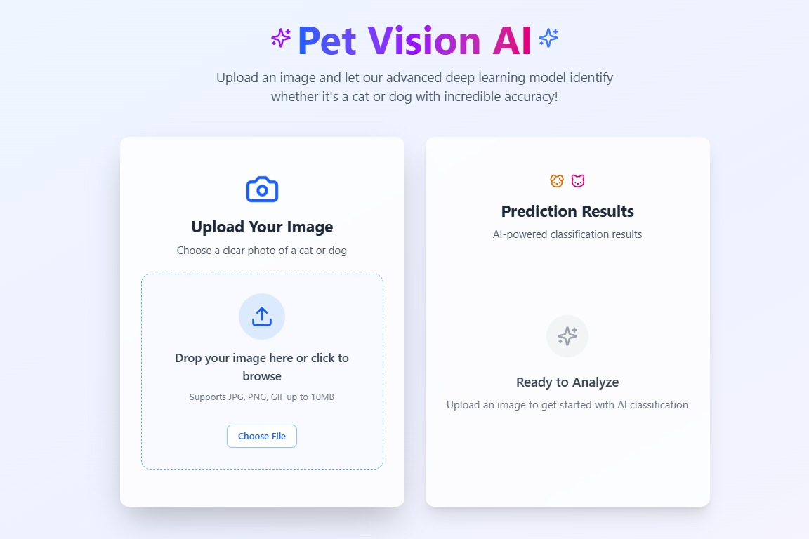
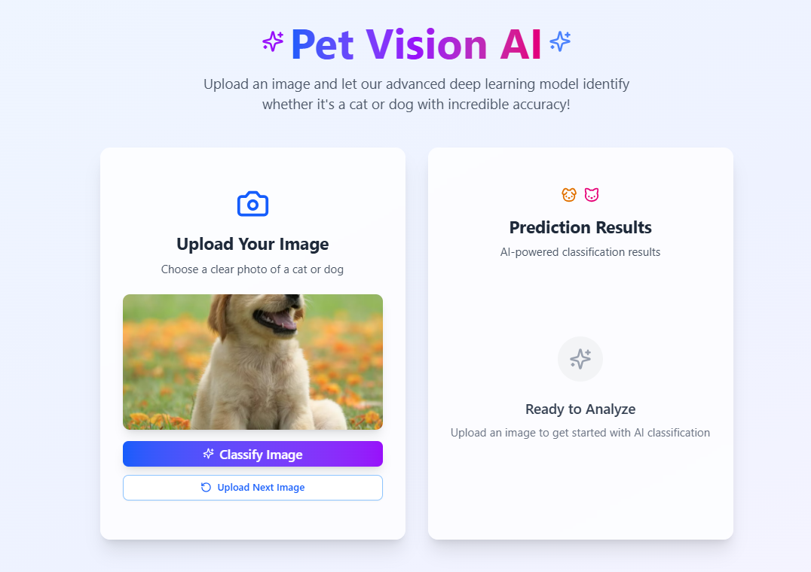
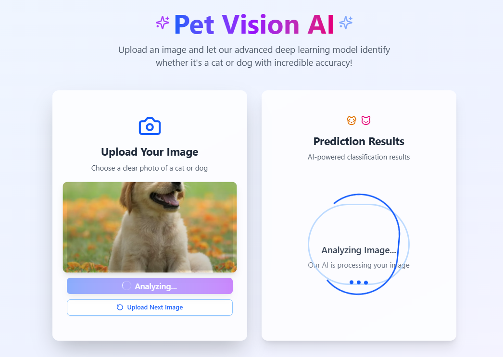
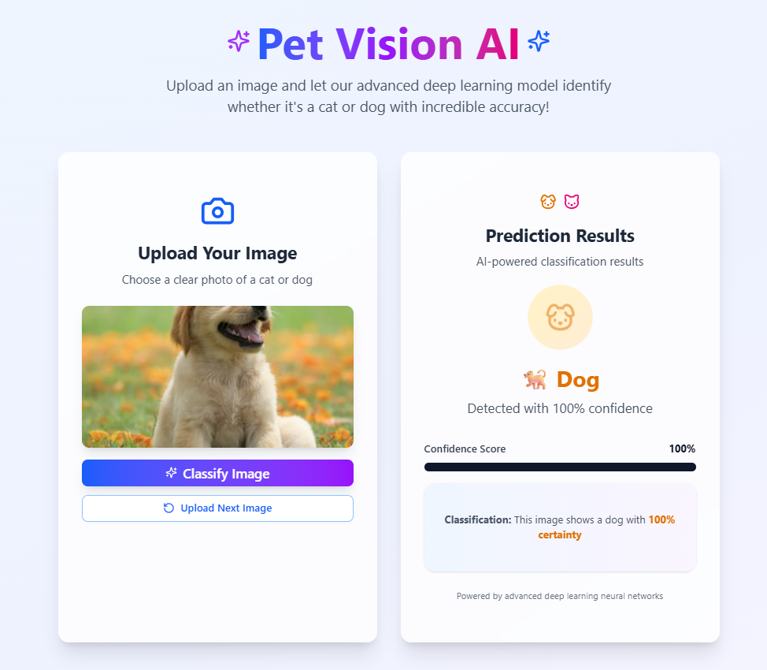
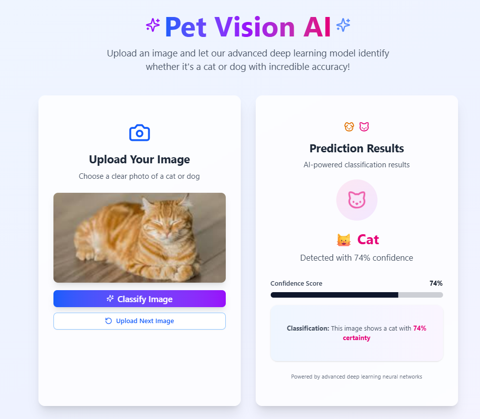

### **Cats and Dogs Image Classifier using CNN (Scratch and Transfer Learning)**

This project is an image classification system designed to distinguish between images of cats and dogs using Convolutional Neural Networks (CNNs). The application leverages two distinct modeling approaches: one model is trained from scratch, while the other employs transfer learning using a pre-trained architecture (xception). The classifier is deployed through a Flask web server and allows users to upload an image and receive a real-time prediction.

---

### **Key Features:**

- ✅ **Two CNN Models:**

  - **Model 1 (Trained from Scratch):** A custom-built CNN trained entirely from the dataset to learn distinguishing features between cats and dogs.
  - **Model 2 (Transfer Learning):** Uses a pre-trained model as the base (xception), with additional layers fine-tuned for the binary classification task.

- 🧠 **Deep Learning Framework:**
  Built using TensorFlow/Keras to design, train, and evaluate the models.

- 💾 **Model Storage:**
  Both trained models are saved in `.h5` (HDF5) format for easy loading and reuse.

- 🌐 **Flask Web Server:**
  A simple and interactive Flask application allows users to upload an image and receive predictions from either model.

- 🖼️ **Image Preprocessing:**
  Input images are resized, normalized, and preprocessed to match the expected input of the respective model.

---

### **Workflow Overview:**

1. **Data Collection & Preprocessing:**

   - Dataset contains labeled images of cats and dogs.
   - Images are resized, augmented (e.g., flipping, zooming), and split into training, validation, and testing sets.

2. **Model 1 – CNN from Scratch:**

   - A custom architecture with convolutional, pooling, and dense layers.
   - Trained for several epochs(20) with validation to prevent overfitting.

3. **Model 2 – Transfer Learning:**

   - A pre-trained model (xception) is loaded without the top layers.
   - Custom dense layers are added and fine-tuned on the cat-dog dataset.

4. **Saving Models:**

   - Trained models are saved as `.h5` files using `model.save()`.

5. **Flask Deployment:**

   - A lightweight Flask app hosts an interface where users can upload an image.
   - The app loads the selected model (`.h5`) and displays the classification result (Cat/Dog) with confidence.

---

### **Technologies Used:**

- Python
- TensorFlow / Keras
- OpenCV / PIL
- Flask
- Next Js (for the frontend)
- Pre-trained CNNs ()

---

### **Images**

